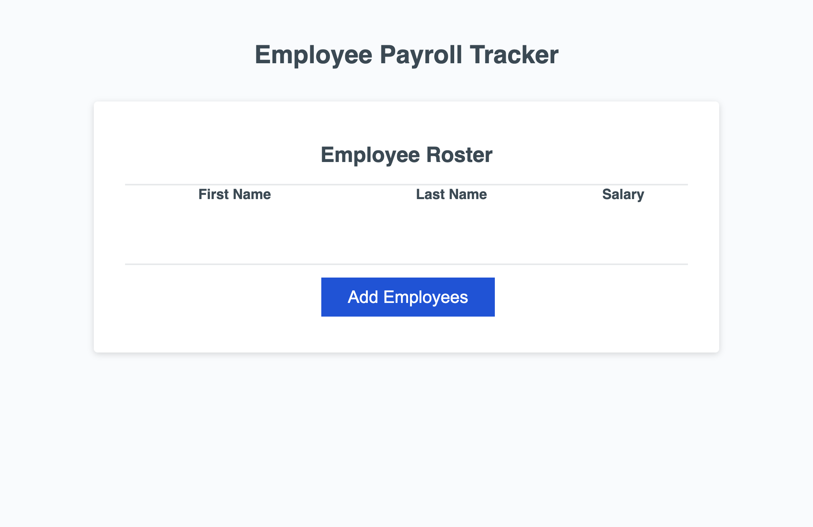

# Employee Payroll Tracker (Module 3 Challenge)

## Description
  An Employee Payroll Tracker application runs in the browser.

## Link
  https://zoooe-brooo.github.io/module-3-challenge-employee-payroll-tracker/

  

## Credits
  Starter code provider: Xandromus
  
  Starter code: https://github.com/coding-boot-camp/curly-potato
  